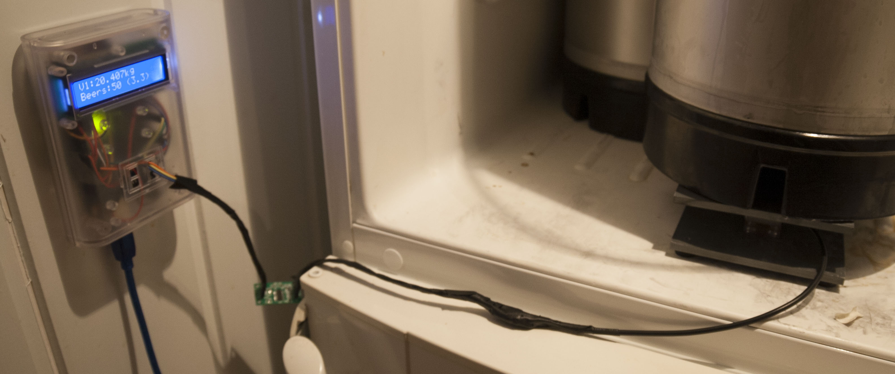
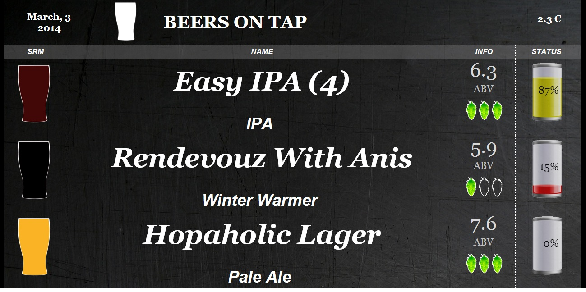

Kegweight
=========

Arduino + HX711 + Weight sensor + Kegerface for monitoring how much beer there is in the keg. 

It is now possible to use it with [Kegerface](https://github.com/andresol/kegerface) and the Weight_kegerface.py script.  

Library used is the [HX711](https://github.com/bogde/HX711) library and [EEPROMEx] (https://github.com/thijse/Arduino-Libraries/tree/master/EEPROMEx)

What you need?
1. One Arduino of course. 
2. Arduino lcd keypad shield. 
3. One or more HX711 (ACD). 
4. One or more Loadcell. It only supports 4. 

Important!!

Before using the weight it needs to be calibrated. Calibrate by hitting the select button->Calibrate. 

This step only needs to be done only one time.

GUIDE: (Needs Arduino, Arduino LCD screen, HX711, Raspberry PI/linux server and a weight).  
1. Install the Weight.ino on a arduino. You may need to change the code from line:54 to line:56 to match your arduino setup. 
2. Calibrate the arduino by pressing select->Calibrate.  
3. Install the weight init.d service. Needs to replace DAEMON=$DIR/Weight.py to Weight_Kegerface.py. (update-rc.d weight defaults)  
4. Install the Weight_Kegerface.py into a folder. E.g /opt/weight/   
5. Install the [Kegerface](https://github.com/andresol/kegerface) into e.g /usr/share/nginx/html  
6. Modify the /usr/share/nginx/html/beers.csv  
7. sudo service weight start. Cross your fingers! It will fail. Fix the bugs and ...  
8. Go to localhost:8080  
